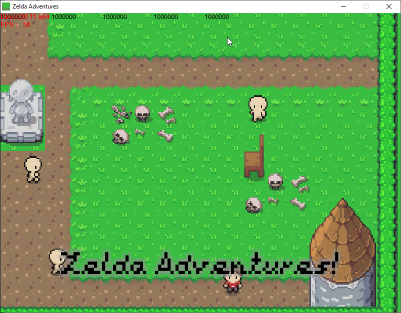
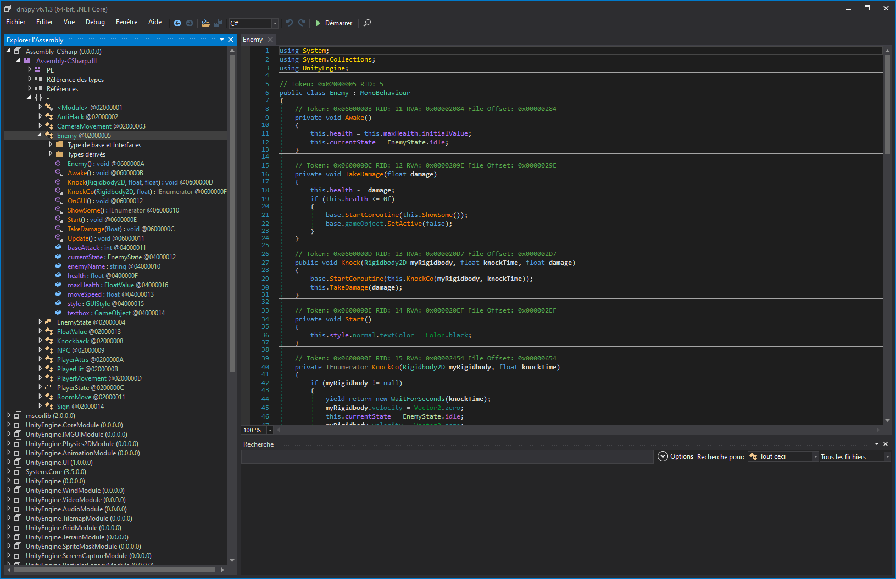
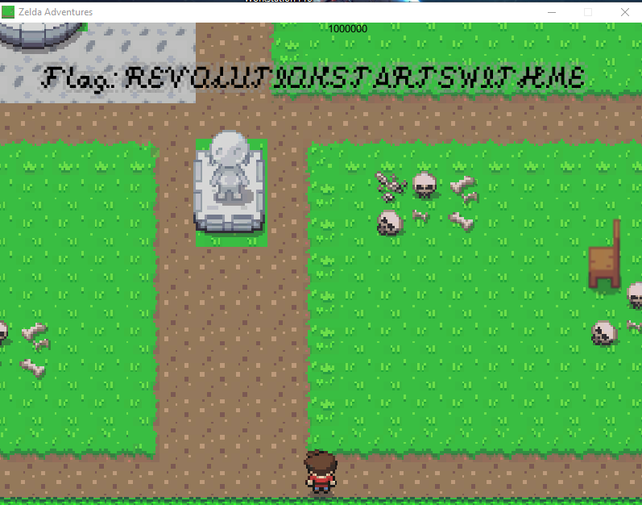
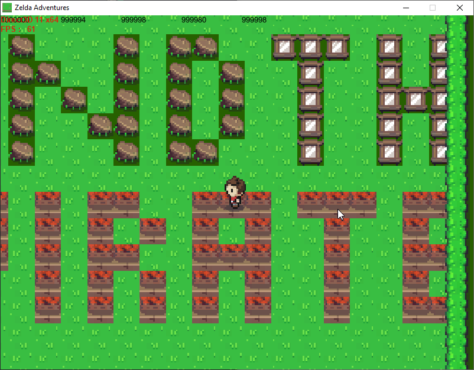
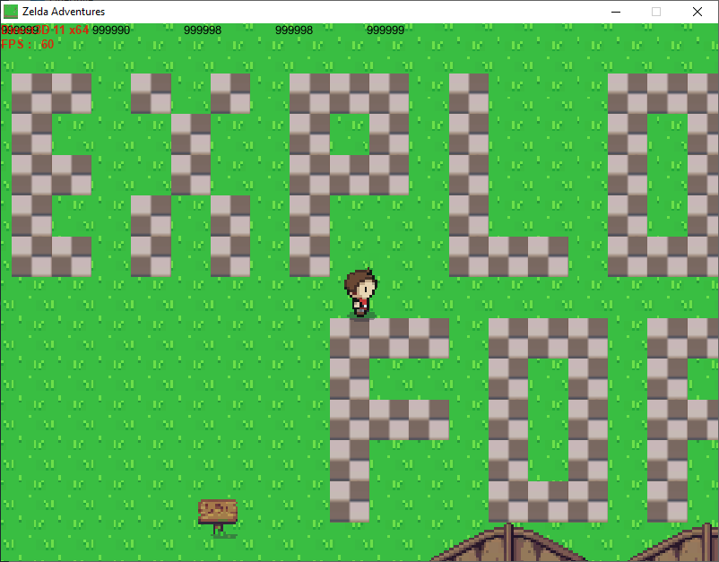

# Zelda Adventures

By [BaptisteBdn](https://github.com/BaptisteBdn)

## Description
This category contained 4 challenges, all based on an unity game. The first three challenges were based on the same game while the fourth one (that was released later) is on a different game and will not be covered in this writeup.

To get the three flag we had to :

- Kill one NPC
- Swim into the pond
- Go to the end of the jungle

## Solution

The file provided are the .exe file that start the game and all the .dll use for the game.
When you start the .exe file, you arrive in the world of Zelda Adventures, be careful to put the screen resolution at 800*600.




The first thing to do is to kill an NPC, if you try you will see that they are immortal, in order to change that I used dnSpy, an assembly editor, to modify the game.
To do so, open the Assembly-CSharp file with dnSpy.



Open the class `Enemy` and take a look at the function `TakeDamage`, we can easily modify it to instantly kill the NPC when it takes damage, just remove the `if` :

```
private void TakeDamage(float damage)
{
  this.health -= damage;
  base.StartCoroutine(this.ShowSome());
  base.gameObject.SetActive(false);
}
```

When the NPC dies, the flag appears on top :



The second and third challenges need you to access places you shouldn't be able to. In order to do that, increase the movement of the character by modifying the `MoveCharacter` function in `PlayerMovement`.

```
private void MoveCharacter()
{
  this.change.Normalize();
  this.myRigidbody.MovePosition(base.transform.position + this.change * this.speed * Time.deltaTime * 2);
}
```

You will now be able to glitch through walls and get the other two flags. For the first one, glitch into the pond to be teleported to the flag.



For the last go into the jungle and follow the obstacle, your speed will glitch through everything and you will be able to see the third flag.


